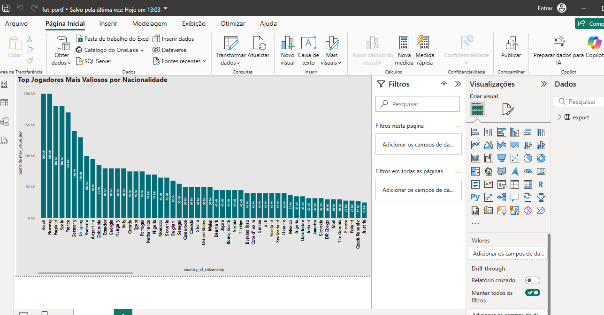

# ⚽ projeto-fut-portf

Pipeline de dados multi-cloud com AWS, Databricks e Power BI usando dados públicos de jogadores de futebol.  
Este projeto simula um fluxo real de engenharia de dados, da ingestão bruta até a visualização final, com foco em performance e reprodutibilidade.

---

## 📌 Objetivo

Construir um pipeline completo para análise de mercado de jogadores, organizando e transformando dados públicos em insights visuais de alto impacto.

---

## 🧱 Arquitetura do Pipeline

Kaggle Dataset (CSV)
↓
AWS S3
↓
AWS Glue Crawler
↓
Glue Data Catalog
↓
Athena
↓
Databricks (PySpark)
↓
Exportação CSV
↓
Power BI

---

## ☁️ Etapas na AWS

- Upload dos arquivos `.csv` do Kaggle para o S3 (`projeto-fut-portf/dados-raw/`)
- Organização automática via script Python (`scripts/s3_uploader.py`)
- Criação de Glue Crawler apontando para as subpastas
- Catalogação automática de 10+ arquivos como tabelas no Glue
- Consulta dos dados diretamente no S3 usando SQL via Athena

---

## ⚙️ Transformação no Databricks

- Leitura do dataset bruto via CSV no Databricks (Community Edition)
- Conversão de tipos, agregações e filtragem com PySpark
- Geração do ranking dos jogadores mais valiosos por nacionalidade
- Exportação do resultado tratado em `.csv` e `.parquet`

---

## 📊 Painel Power BI

- Visualização do valor de mercado máximo por país
- Uso de rótulos, ordenação e design visual limpo

---

## 📁 Estrutura do Projeto

projeto-fut-portf/
├── data/ # (opcional) amostra dos dados
├── notebooks/
│ └── fut_portf_pipeline.ipynb # notebook do Databricks
├── powerbi/
│ └── dashboard_top_jogadores.pbix
├── scripts/
│ └── s3_uploader.py # script de automação S3
├── imgs/
│ └── dashboard_preview.png
│ └── s3_bucket_view.png
│ └── glue_catalog.png
│ └── athena_query.png
├── README.md
└── LICENSE

---

## 📚 Fonte dos Dados

- Kaggle: [Player Scores Dataset](https://www.kaggle.com/datasets/davidcariboo/player-scores)

---

## 🚀 O que esse projeto comprova

- Ingestão automatizada em nuvem (AWS S3 + boto3)
- Catalogação e consulta via AWS Glue + Athena
- Transformações com PySpark no Databricks
- Exportação e visualização com Power BI
- Pipeline completo, modular e replicável

